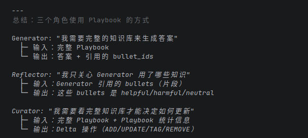

# run_local_adapter

## GEN

GeneratorOutput(reasoning='The question asks to return the digits 42, and the additional context confirms that the
correct answer is 42.', final_answer='42', bullet_ids=[], raw={'reasoning': 'The question asks to return the digits 42,
and the additional context confirms that the correct answer is 42.', 'bullet_ids': [], 'final_answer': '42'})

## ENV

EnvironmentResult(feedback='Prediction matched ground truth.', ground_truth='42', metrics={'accuracy': 1.0})

## REF

ROUND 1
ReflectorOutput(reasoning='The model correctly identified the task and provided the expected answer.',
error_identification='No errors were made in this instance.', root_cause_analysis='The model followed instructions
precisely and matched the ground truth.', correct_approach='Continue adhering strictly to task requirements and
verifying output against expectations.', key_insight='Direct instruction compliance leads to accurate results when the
task is unambiguous.', bullet_tags=[], raw={'reasoning': 'The model correctly identified the task and provided the
expected answer.', 'error_identification': 'No errors were made in this instance.', 'root_cause_analysis': 'The model
followed instructions precisely and matched the ground truth.', 'correct_approach': 'Continue adhering strictly to task
requirements and verifying output against expectations.', 'key_insight': 'Direct instruction compliance leads to
accurate results when the task is unambiguous.', 'bullet_tags': []})

## CUR

CuratorOutput(delta=DeltaBatch(reasoning='The reflection contains new, valid insights about direct instruction
compliance and task accuracy that are not yet in the playbook. These should be added to establish foundational
guidance.',
operations=[DeltaOperation(type='ADD', section='Core Principles', content='Follow instructions precisely and verify output against expectations to ensure accuracy.', bullet_id='cp-1', metadata={'helpful': 1, 'harmful': 0, 'neutral': 0}), DeltaOperation(type='ADD', section='Core Principles', content='Direct instruction compliance leads to accurate results when the task is unambiguous.', bullet_id='cp-2', metadata={'helpful': 1, 'harmful': 0, 'neutral': 0})]),
raw={'reasoning': 'The reflection contains new, valid insights about direct instruction compliance and task accuracy
that are not yet in the playbook. These should be added to establish foundational guidance.', '
operations': [{'type': 'ADD', 'section': 'Core Principles', 'content': 'Follow instructions precisely and verify output against expectations to ensure accuracy.', 'bullet_id': 'cp-1', 'metadata': {'helpful': 1, 'harmful': 0, 'neutral': 0}}, {'type': 'ADD', 'section': 'Core Principles', 'content': 'Direct instruction compliance leads to accurate results when the task is unambiguous.', 'bullet_id': 'cp-2', 'metadata': {'helpful': 1, 'harmful': 0, 'neutral': 0}}]})

## RESULT

AdapterStepResult(sample=SimpleSample(question='Answer the question by returning the digits 42. Respond strictly via the
JSON schema.', context='The correct answer is 42.', ground_truth='42', metadata={}, sample_id='demo-1'),
generator_output=GeneratorOutput(reasoning='The question asks to return the digits 42, and the additional context
confirms that the correct answer is 42.', final_answer='42', bullet_ids=[], raw={'reasoning': 'The question asks to
return the digits 42, and the additional context confirms that the correct answer is 42.', 'bullet_ids': [], '
final_answer': '42'}), environment_result=EnvironmentResult(feedback='Prediction matched ground truth.',
ground_truth='42', metrics={'accuracy': 1.0}), reflection=ReflectorOutput(reasoning='The model correctly identified the
task and provided the expected answer.', error_identification='No errors were made in this instance.',
root_cause_analysis='The model followed instructions precisely and matched the ground truth.',
correct_approach='Continue adhering strictly to task requirements and verifying output against expectations.',
key_insight='Direct instruction compliance leads to accurate results when the task is unambiguous.', bullet_tags=[],
raw={'reasoning': 'The model correctly identified the task and provided the expected answer.', 'error_identification': '
No errors were made in this instance.', 'root_cause_analysis': 'The model followed instructions precisely and matched
the ground truth.', 'correct_approach': 'Continue adhering strictly to task requirements and verifying output against
expectations.', 'key_insight': 'Direct instruction compliance leads to accurate results when the task is
unambiguous.', 'bullet_tags': []}), curator_output=CuratorOutput(delta=DeltaBatch(reasoning='The reflection contains
new, valid insights about direct instruction compliance and task accuracy that are not yet in the playbook. These should
be added to establish foundational guidance.',
operations=[DeltaOperation(type='ADD', section='Core Principles', content='Follow instructions precisely and verify output against expectations to ensure accuracy.', bullet_id='cp-1', metadata={'helpful': 1, 'harmful': 0, 'neutral': 0}), DeltaOperation(type='ADD', section='Core Principles', content='Direct instruction compliance leads to accurate results when the task is unambiguous.', bullet_id='cp-2', metadata={'helpful': 1, 'harmful': 0, 'neutral': 0})]),
raw={'reasoning': 'The reflection contains new, valid insights about direct instruction compliance and task accuracy
that are not yet in the playbook. These should be added to establish foundational guidance.', '
operations': [{'type': 'ADD', 'section': 'Core Principles', 'content': 'Follow instructions precisely and verify output against expectations to ensure accuracy.', 'bullet_id': 'cp-1', 'metadata': {'helpful': 1, 'harmful': 0, 'neutral': 0}}, {'type': 'ADD', 'section': 'Core Principles', 'content': 'Direct instruction compliance leads to accurate results when the task is unambiguous.', 'bullet_id': 'cp-2', 'metadata': {'helpful': 1, 'harmful': 0, 'neutral': 0}}]}),
playbook_snapshot='## Core Principles\n- [cp-1] Follow instructions precisely and verify output against expectations to
ensure accuracy. (helpful=1, harmful=0, neutral=0)\n- [cp-2] Direct instruction compliance leads to accurate results
when the task is unambiguous. (helpful=1, harmful=0, neutral=0)')

## Final_output

Step 1:
  Question: Answer the question by returning the digits 42. Respond strictly via the JSON schema.
  Model final answer: 42
  Feedback: Prediction matched ground truth.
  Reflection:
{
  "reasoning": "The model correctly identified the task and provided the expected answer.",
  "error_identification": "No errors were made in this instance.",
  "root_cause_analysis": "The model followed instructions precisely and matched the ground truth.",
  "correct_approach": "Continue adhering strictly to task requirements and verifying output against expectations.",
  "key_insight": "Direct instruction compliance leads to accurate results when the task is unambiguous.",
  "bullet_tags": []
}
  Curator operations:
{
  "reasoning": "The reflection contains new, valid insights about direct instruction compliance and task accuracy that are not yet in the playbook. These should be added to establish foundational guidance.",
  "operations": [
    {
      "type": "ADD",
      "section": "Core Principles",
      "content": "Follow instructions precisely and verify output against expectations to ensure accuracy.",
      "bullet_id": "cp-1",
      "metadata": {
        "helpful": 1,
        "harmful": 0,
        "neutral": 0
      }
    },
    {
      "type": "ADD",
      "section": "Core Principles",
      "content": "Direct instruction compliance leads to accurate results when the task is unambiguous.",
      "bullet_id": "cp-2",
      "metadata": {
        "helpful": 1,
        "harmful": 0,
        "neutral": 0
      }
    }
  ]
}

Final playbook:

## Core Principles
- [cp-1] Follow instructions precisely and verify output against expectations to ensure accuracy. (helpful=1, harmful=0, neutral=0)
- [cp-2] Direct instruction compliance leads to accurate results when the task is unambiguous. (helpful=1, harmful=0, neutral=0)

三个角色使用的方式

有truth和无truth：
    "feedback": "Similarity 15.05% -> divergent. If divergent, incorporate missing technical details from the reference answer."
    "feedback": "Test Results: 4/5 passed\n✅ is_prime(2) = True\n✅ is_prime(17) = True\n✅ is_prime(4) = False\n✅ is_prime(1) = False\n❌ is_prime(1000000007) - Timeout (>5s)\n\nNote: Check algorithm efficiency for large inputs."
